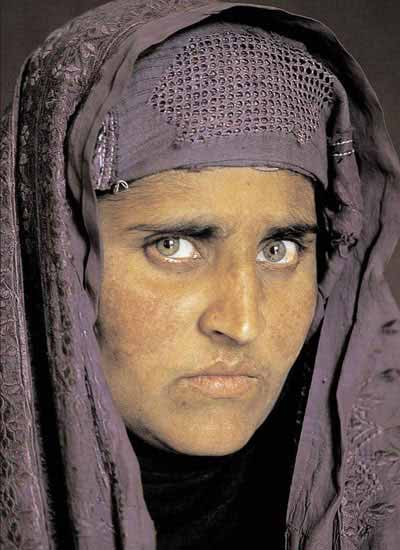
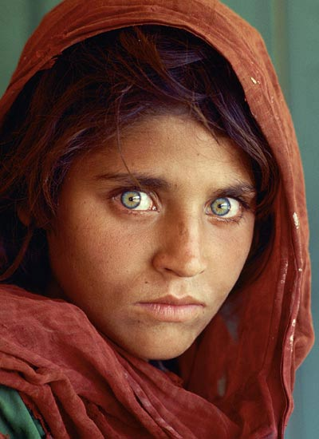
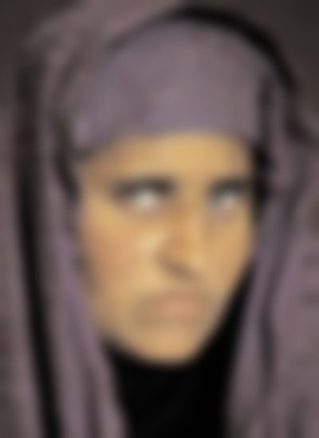
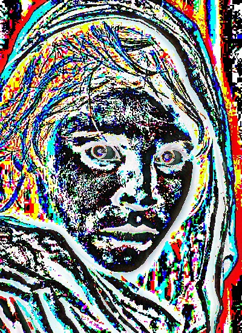
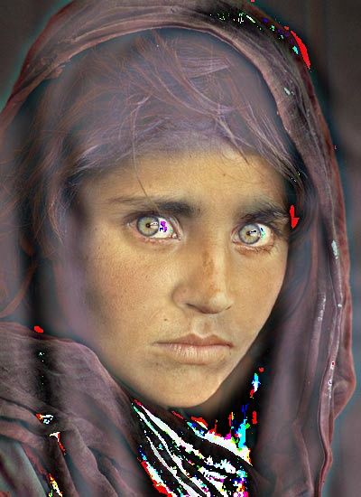

# Hybrid_Image

A hybrid image is the sum of a low-pass filtered version of  one image and a high-pass filtered version of a second image. There is a free parameter, which can be tuned for each image pair, which controls how much high frequency to remove from the first image and how much low frequency to leave in the second image. This is called the “cutoff-frequency”.

Reading this [paper](https://stanford.edu/class/ee367/reading/OlivaTorralb_Hybrid_Siggraph06.pdf) will help in understanding of hybrid images.

### Input Images:

Image-1:

Image-2:

# Results: 
### High and Low frequency Images:

Low-pass filtered Image-1:  

High-pass filtered Image-2:

### Hybrid Image:

